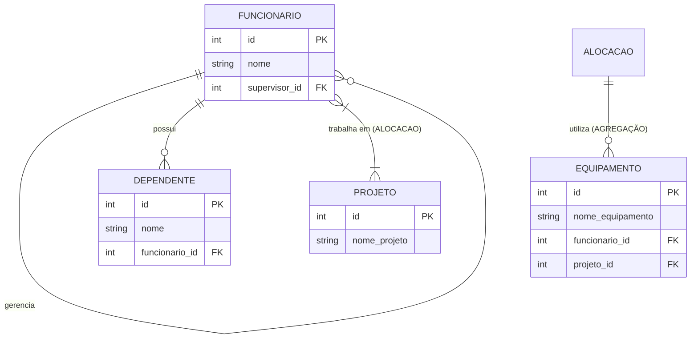

# Projeto de Banco de Dados; UNISL AFYA - Autorelacionamento, Entidade Fraca e Agregação

Projeto de banco de dados PostgreSQL demonstrando três conceitos de modelagem: **autorelacionamento**, **dependência de existência** ***(entidade fraca)*** e **agregação**.

## Diagrama MERMAID



## Conceitos Aplicados

### Autorelacionamento

A tabela de `funcionario` possui um caso de **autorelacionamento** através da coluna de `supervisor_id`, uma chave estrangeira que aponta pro **ID** da própria tabela. Isso deixa ela representar uma hierarquia: cada funcionário pode ter um **supervisor**, mas os **supervisores** também s~ão funcionários.

```sql
CREATE TABLE funcionario (
    id SERIAL PRIMARY KEY,
    nome VARCHAR(100) NOT NULL,
    supervisor_id INTEGER REFERENCES funcionario(id)
);
```

Pra consultar a hierarquia, é necessário um `JOIN` da tabela com ela mesma *(usando aliases diferentes)*, com `LEFT JOIN` para garantir que funcionários sem supervisor *(tipo um diretor)* também apareçam no resultado:

```sql
SELECT
    f.nome AS funcionario,
    s.nome AS supervisor
FROM funcionario f
LEFT JOIN funcionario s ON f.supervisor_id = s.id;
```

### Dependência de Existência (Entidade Fraca)

A tabela `dependente` representa uma **entidade fraca**: um dependente só faz sentido existir se estiver vinculado a um funcionário. Por isso, a chave estrangeira usa `ON DELETE CASCADE` — se o funcionário for excluído, seus dependentes são excluídos automaticamente, evitando registros "órfãos" no banco.

```sql
CREATE TABLE dependente (
    id SERIAL PRIMARY KEY,
    nome VARCHAR(100) NOT NULL,
    funcionario_id INTEGER NOT NULL,
    CONSTRAINT fk_funcionario
        FOREIGN KEY (funcionario_id)
        REFERENCES funcionario(id)
        ON DELETE CASCADE
);
```

### Agregação

O relacionamento entre `funcionario` e `projeto` *(a "alocação" de um funcionário em um projeto)* é tratado como uma entidade de nível superior, para que o equipamento se relacione com esse par específico, e não com `funcionario` ou `projeto` de forma isolada.

Isso é implementado na tabela `alocacao_equipamento`, que carrega as duas chaves estrangeiras *(`funcionario_id` e `projeto_id`)* junto com os dados do equipamento:

```sql
CREATE TABLE alocacao_equipamento (
    id SERIAL PRIMARY KEY,
    funcionario_id INTEGER,
    projeto_id INTEGER,
    nome_equipamento VARCHAR(100),
    FOREIGN KEY (funcionario_id) REFERENCES funcionario(id),
    FOREIGN KEY (projeto_id) REFERENCES projeto(id)
);
```

Dessa forma, um mesmo equipamento fica associado especificamente ao par (funcionário, projeto), representando o cenário real de "notebook X está com funcionário Y, enquanto ele trabalha no projeto Z".

## Estrutura do Repositório

- `schema.sql` — script completo com criação das tabelas, dados de teste e queries de demonstração.
- `README.md` — este arquivo.

## Execução

```bash
psql -U usuario -d banco -f schema.sql
```
